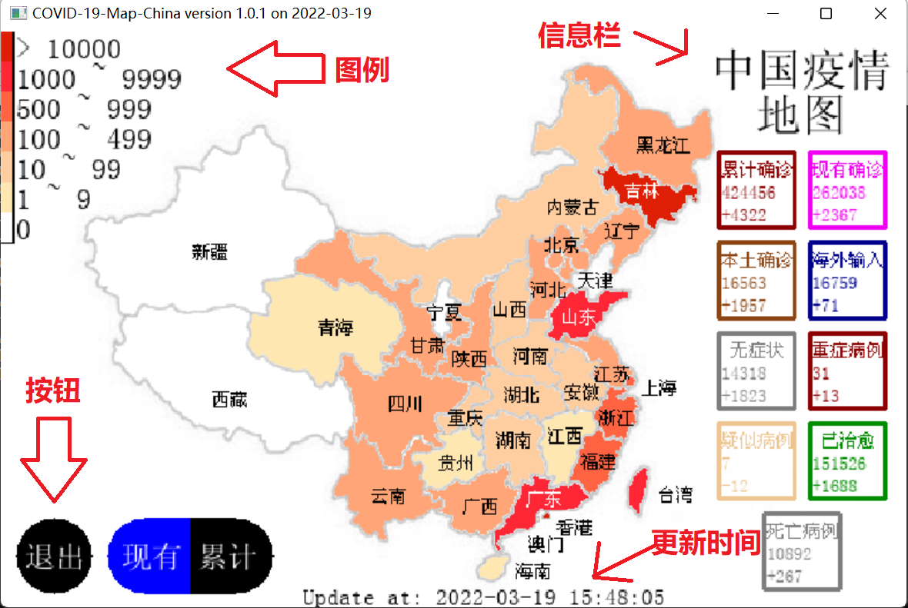
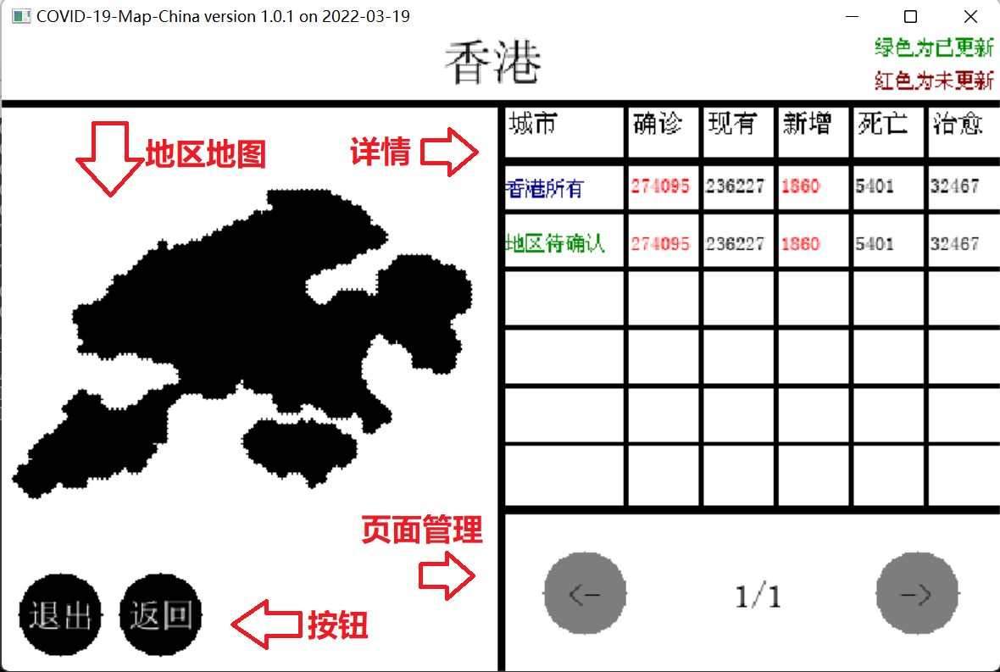

# 中国疫情地图 COVID-19-MAP-CHINA

版本1.2.2(正式)2022.3.25
By YiMoXia at 2022-03-25.  

## Overview 预览

中国疫情一览地图。采用可视化设计，分为七个等级，一览感染人数、死亡人数等信息。

## Usage 用法

[主程序](map.py)直接运行。

``` powershell
# Windows 7/10/11
python map.py
# OSx(MacOS) or Linux
python3 map.py
# or use python3-py
py map.py
```

### 页面说明




## Changelog [更新记录](changelog.md)

## 最新：中国疫情地图版本1.2.0 [更新] 2022.3.21

- 1. [Add] 新增“新增确诊”地图查看模式，看新增。

## Third-Party 第三方库

安装：`pip install -r requirements.txt`

## Notice 注意

### 1.总地图

此项目的地图在原图上经过了特殊的处理。有的地方不是1：1大小或者不是非常得像，这些全是为
了用户的使用体验，现指出所有经过修改的部分：

- 1. 香港经过了变大处理，因此看着比上海一样大。
- 2. 澳门也经过了变大处理，但是没有香港大，像素比为1:6。
- 3. 河北廊坊市北部地区（即为四周被北京和天津包围的部分，隶属廊坊市）原来导入的地图是没有的，后来经过了添加，可能与实际不太相符（包括北京和天津）
- 4. 原图地址为：[点击前往](https://gss0.baidu.com/-Po3dSag_xI4khGko9WTAnF6hhy/zhidao/pic/item/962bd40735fae6cd1851ec8201b30f2443a70f6f.jpg)，涂色的图是原图经过了特殊处理的。
- 5. 下载下来的原图(map_background.png)也因为涂色图修改过。

### 2.香港地图

香港城市详情页面使用了单独的[地图](map_hongkong.png)。原图地址为：[点击前往](https://image.baidu.com/search/down?tn=download&word=download&ie=utf8&fr=detail&url=https%3A%2F%2Fgimg2.baidu.com%2Fimage_search%2Fsrc%3Dhttp%253A%252F%252Fnimg.ws.126.net%252F%253Furl%253Dhttp%25253A%25252F%25252Fdingyue.ws.126.net%25252F2022%25252F0221%25252Fb5d8b3bfj00r7mv7r005dd000u000nsp.jpg%2526thumbnail%253D650x2147483647%2526quality%253D80%2526type%253Djpg%26refer%3Dhttp%253A%252F%252Fnimg.ws.126.net%26app%3D2002%26size%3Df9999%2C10000%26q%3Da80%26n%3D0%26g%3D0n%26fmt%3Dauto%3Fsec%3D1650013696%26t%3Df01728dd3ff7591ecb3ae5c735e37d31&thumburl=https%3A%2F%2Fimg1.baidu.com%2Fit%2Fu%3D3995791477%2C4271156570%26fm%3D253%26fmt%3Dauto%26app%3D120%26f%3DJPEG%3Fw%3D630%26h%3D500)

### 3. 澳门地图

澳门城市详情页面使用了单独的[地图](map_macao_2.png)。原图地址为：[点击前往](https://gimg2.baidu.com/image_search/src=http%3A%2F%2Fwww.onegreen.net%2Fmaps%2FUpload_maps%2F201308%2F2013081409354011.jpg&refer=http%3A%2F%2Fwww.onegreen.net&app=2002&size=f9999,10000&q=a80&n=0&g=0n&fmt=auto?sec=1650017835&t=6f9810879ff42a83f05c13cc8090d593)

### 4. 病毒信息源

腾讯疫情为本项目的信息来源。

[官方展示->](https://news.qq.com//zt2020/page/feiyan.htm)
[API接口->](https://view.inews.qq.com/g2/getOnsInfo?name=disease_h5)
